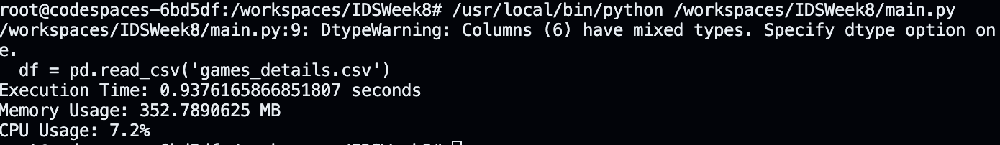

[](https://github.com/nogibjj/IDSWeek8/actions/workflows/python-package.yml)
## Rust vs Python: Performance Comparison

This repository contains a comparison of performance metrics between Rust and Python while handling and sorting a large CSV dataset.

### Objective

The goal was to determine the differences in execution time, memory usage, and CPU usage between Rust and Python while processing and sorting the same dataset.

### Method

1. A CSV dataset of many NBA games located at `/workspaces/IDSWeek8/games_details.csv` was utilized.
2. The dataset was read, deserialized into structures/objects, and sorted based on the 'PTS' column.
3. Performance metrics (execution time, memory usage, and CPU usage) were captured to see differences between rust and python.

### Results

Here are the observed results for both Rust and Python:

| Metric        | Rust                          | Python                       |Rust Improvement 
|---------------|-------------------------------|------------------------------|-----------------
| Execution Time| 214.442249ms                  | 937.6165866851807ms          |4.37x
| Memory Usage  | 1 MB                          | 352.7890625 MB               |353x
| CPU Usage     | 92.50%                        | 7.2%                         | 13x Worse

### Analysis

Rust displayed significantly faster execution time and considerably lower memory usage than Python. However, Rust's CPU usage was notably higher. This could be attributed to Rust's ability to leverage system resources more aggressively to achieve faster execution speeds.

### Python Script Usage
```bash
python main.py
```


### Rust Script Usage
```bash
cd rustStuff/
cargo build
cargo run --release
```

### Conclusion

For tasks involving reading, deserializing, and sorting large datasets, Rust can offer improvements in execution speed and memory efficiency compared to Python, albeit with higher CPU usage.
